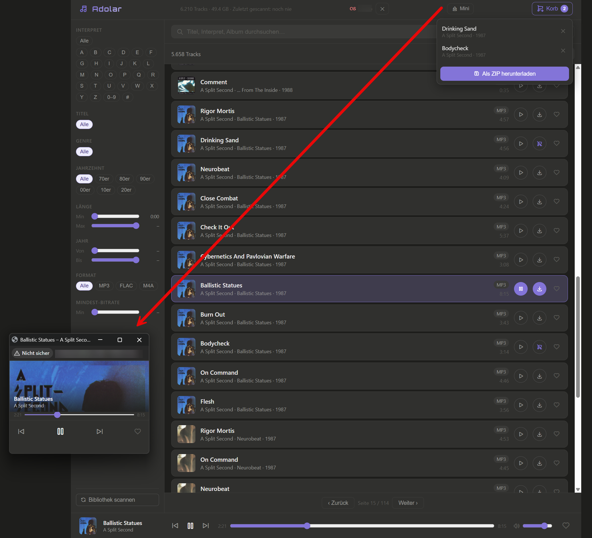
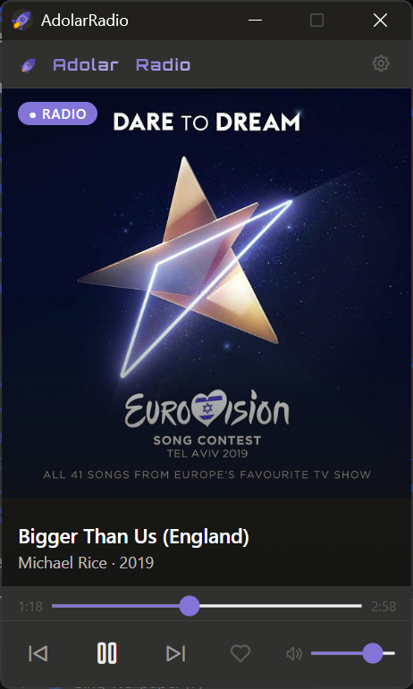

# Adolar

A self-hosted music archive web app for Synology NAS (or any Docker host). Browse, search, and stream your local MP3/FLAC/M4A collection from any browser — no cloud required.


## Features

- **Full-text search** across title, artist, album, and genre (SQLite FTS5)
- **Facet filters** — genre, decade, year range, duration, format, bitrate, artist/title initial
- **Cover art** with colored initials fallback
- **HTTP range streaming** — seekable audio in the browser
- **Radio / Shuffle mode** — starts instantly, equal-power crossfade (12 s out / 8 s in), next track pre-buffered silently before crossfade begins
- **AdolarRadio** — Windows companion app: native window without browser, auto-starts radio, settings dialog for server URL, buildable to a single `.exe`
- **Mini-player** — popup window that stays open across tab switches, shows cover art, controls, progress bar, and Last.fm love button
- **Download basket** — select tracks and export as ZIP
- **Background scanner** — indexes your music library without blocking the UI; re-scans skip unchanged files (mtime check) for fast incremental updates
- **Play count tracking** — reads and writes ID3 `PCNT` (MP3), Vorbis comment (FLAC), iTunes tag (M4A) at 90 % playback; uses `MAX(tag, db) + 1` to protect counts from external players
- **Last.fm integration** — Now Playing, Scrobble (at 50 %), Love / Unlove tracks
- **Now Playing in browser tab** — scrolling page title `Track – Artist (Year)` while playing
- **Cover art** with colored initials fallback; broken images automatically replaced by initials
- **Dark mode** — warm gray palette

## Screenshot



## Requirements

- Docker + Docker Compose
- A Last.fm API account (optional, for scrobbling)

## Setup

### 1. Clone

```bash
git clone https://github.com/noyse27/musicapp.git
cd musicapp
```

### 2. Configure

Copy the example env file and fill in your Last.fm credentials:

```bash
cp .env.example .env
```

```env
LASTFM_API_KEY=your_api_key_here
LASTFM_API_SECRET=your_api_secret_here
```

Get a free API key at [last.fm/api/account/create](https://www.last.fm/api/account/create).  
Leave the Callback URL field empty — the app passes it dynamically.

### 3. Edit `docker-compose.yml`

Point the music volume at your library:

```yaml
volumes:
  - /volume1/music:/music:ro   # adjust to your path
  - adolar-data:/data
```

### 4. Run

```bash
docker-compose up --build -d
```

The app is available at `http://<host>:15002`.

## First scan

Open the app, click the **⟳** button in the top bar to start indexing your library.  
A progress banner appears while scanning. The app is fully usable while the scan runs.

## Last.fm

1. Click **Last.fm verbinden** in the top bar
2. Authorize on Last.fm → you are redirected back automatically
3. Your username appears in the top bar — you're connected

To disconnect, click the **✕** next to your username.

| Event | Trigger |
|---|---|
| Now Playing | Immediately when a track starts |
| Scrobble | After 50 % playback (min. 30 s) |
| Love / Unlove | Heart button in player or track row |

## Mini-Player

Click **Mini** in the top bar to open a detached popup window. It shows cover art, track title, artist, progress bar with seek, and play/pause/skip/love controls. The window stays open when you switch browser tabs. State is synced via `BroadcastChannel`.

## AdolarRadio – Windows Companion App



A native Windows window that opens the Adolar radio mode — no browser required.

**Run directly (Python):**
```bat
cd companion
pip install pywebview
python adolar_radio.py
```

On first launch a settings dialog asks for the Adolar server URL (e.g. `http://192.168.1.100:15002`). The setting is saved to `%APPDATA%\AdolarRadio\config.json`. The gear icon in the title bar reopens settings at any time.

**Build a single `.exe`:**
```bat
cd companion
build.bat
```
The finished `AdolarRadio.exe` is placed in `companion\dist\`.

**Or open in browser directly:**  
`http://<host>:15002/radio`

## Play Count

Play counts are stored in both the SQLite database and the audio file tag:

| Format | Tag |
|---|---|
| MP3 | ID3 `PCNT` frame |
| FLAC | Vorbis comment `PLAY_COUNT` |
| M4A | iTunes custom tag `play_count` |

On playback (90 % reached), the app reads the current tag value first and uses `MAX(tag, db) + 1` — so play counts from external players (foobar2000, etc.) are never lost.

## Environment Variables

| Variable | Default | Description |
|---|---|---|
| `MUSIC_ROOT` | `/music` | Path to music library inside container |
| `DB_PATH` | `/data/adolar.db` | SQLite database path |
| `LASTFM_API_KEY` | — | Last.fm API key |
| `LASTFM_API_SECRET` | — | Last.fm shared secret |
| `CORS_ORIGINS` | *(none)* | Space-separated allowed origins (empty = deny all cross-origin) |
| `MAX_DOWNLOAD_IDS` | `500` | Maximum tracks per ZIP download |

## Supported Formats

MP3, FLAC, M4A, OGG, Opus, AAC, WAV

## Tech Stack

| Layer | Technology |
|---|---|
| Backend | Python 3.12 / Flask 3 |
| Database | SQLite with FTS5 |
| Tag reading/writing | mutagen |
| Frontend | Vanilla JS, Tabler Icons |
| Container | Docker / Gunicorn |

## License

MIT
